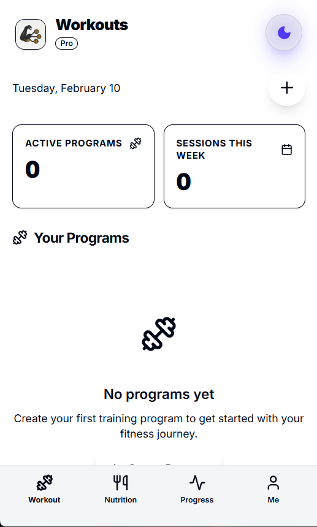
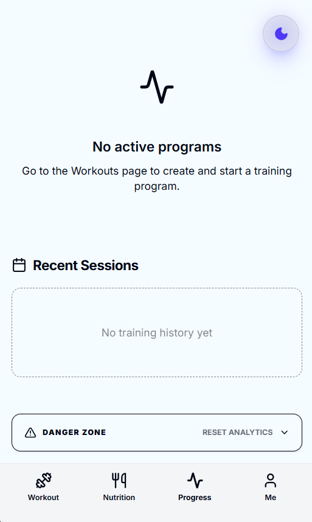
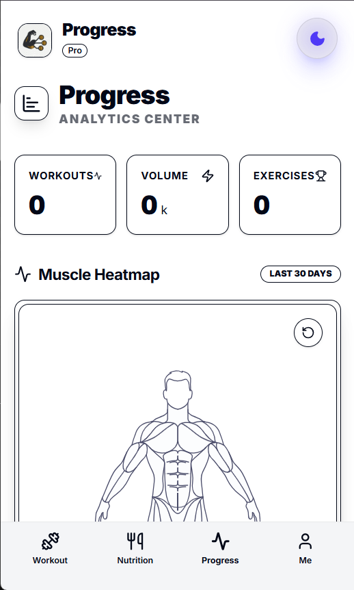
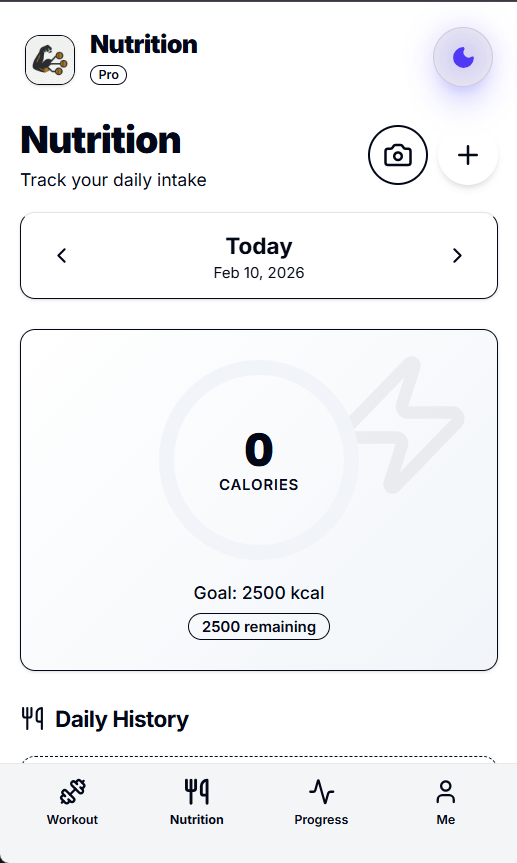
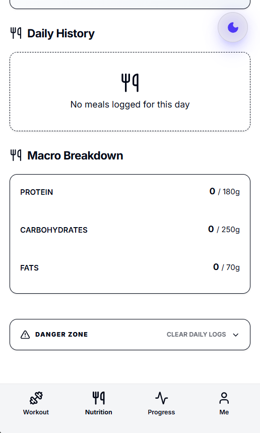
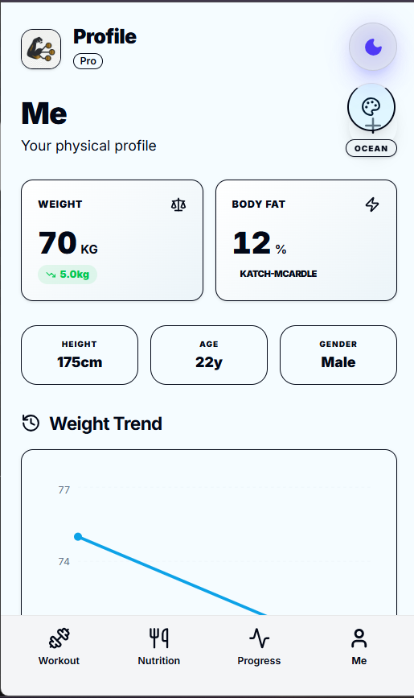
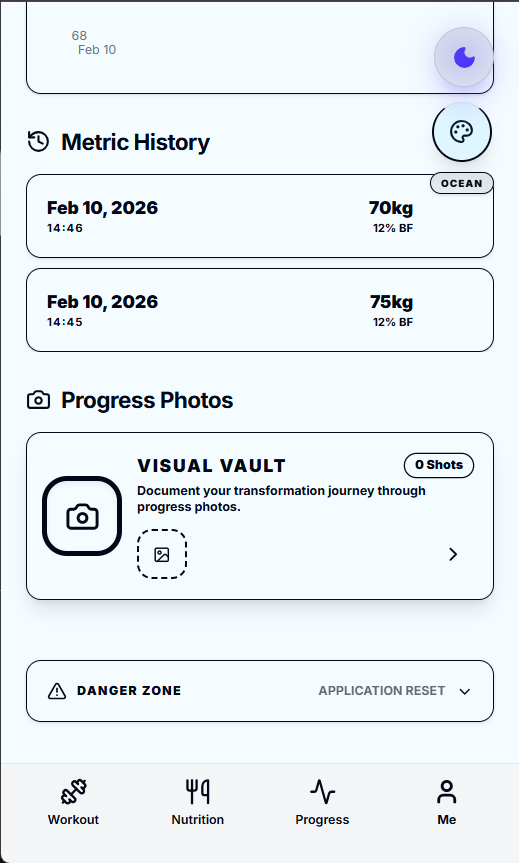

# FitTrack Pro 🏋️‍♂️

A powerful, mobile-first personal gym tracker built with **Next.js 15**, **PWA capabilities**, and a **local-first architecture** using Dexie.js.

Designed for serious lifters who want granular control over their data without relying on cloud subscriptions.

---

## ✨ Key Features

### 💪 Smart Workout Tracking (`/workouts`)
- **Custom Program Builder**: Create sophisticated workout splits (e.g., PPL, Upper/Lower, Full Body).
- **Session Logging**: Track every set, rep, and weight with ease.
- **Volume Tracking**: Automatic calculation of total volume per session.
- **History Management**: Review past workouts and personal bests.
- **Offline Support**: Fully functional without an internet connection.


*Manage your training programs and start new sessions.*


*Track your workout live with set-by-set logging.*

### 📊 Advanced Analytics (`/progress`)
- **Muscle Heatmap**: Visual representation of your training frequency across different muscle groups (Last 30 days).
- **Volume Charts**: Track your lifting volume trends over time.
- **Exercise Stats**: Detailed breakdown of sets, reps, and max weight for each movement.
- **Program Performance**: Compare progress across different training splits.


*Detailed analytics including volume trends and workout frequency.*


*visualising the training volume for every muscle. (Front & Back views).*

### 🥗 Nutrition & AI Scanning (`/nutrition`)
- **Macro Tracking**: Log daily protein, carbs, fats, and calories.
- **AI Meal Scanner**: Snap a photo of your food, and our AI (powered by Google Gemini) automatically estimates macros and calories.
- **Daily History**: Detailed log of all meals with quick-add functionality.
- **Goal Setting**: Set and visualize daily nutrition targets with progress rings.


*Track your daily macros and calories at a glance.*


*Instant food analysis using AI-powered image recognition.*

### 👤 Body Metrics & "Visual Vault" (`/me`)
- **Body Stats**: Track weight, body fat %, and measurements.
- **Weight Trends**: Interactive charts showing weight fluctuation and trends.
- **Progress Photos**: Secure "Visual Vault" to store and compare physique updates over time (stored locally).
- **Data Privacy**: All data is stored locally on your device via IndexedDB.


*Monitor your body composition and physical stats.*


*Securely store and view your transformation journey.*

---

## � Tech Stack

- **Framework**: Next.js 16 (React 19)
- **Database**: Dexie.js (IndexedDB wrapper) - *Local First!*
- **Styling**: Tailwind CSS v4
- **UI Components**: Custom Shadcn-like components with Framer Motion animations
- **AI**: Google Generative AI (Gemini) for image recognition
- **PWA**: Next-PWA for offline capabilities and installability
- **Icons**: Lucide React
- **Charts**: Recharts

---

## 🚀 Getting Started

1. **Clone the repository**
   ```bash
   git clone https://github.com/yourusername/fittrack-pro.git
   cd fittrack-pro
   ```

2. **Install dependencies**
   ```bash
   npm install
   ```

3. **Environment Setup**
   Create a `.env.local` file in the root directory and add your Google Gemini API key for the meal scanner:
   ```env
   NEXT_PUBLIC_GEMINI_API_KEY=your_api_key_here
   ```

4. **Run the development server**
   ```bash
   npm run dev
   ```

5. **Open the app**
   Navigate to [http://localhost:3000](http://localhost:3000) (creates a specialized mobile view).

---

## � Mobile Installation (PWA)

1. Open the app in **Chrome** (Android) or **Safari** (iOS).
2. Tap the **Share** button (iOS) or **Menu** (Android).
3. Select **"Add to Home Screen"**.
4. Launch the app from your home screen for a full-screen, native-like experience.

---

## 📄 License

© 2026 Oubaid Boussaidi. All Rights Reserved.
